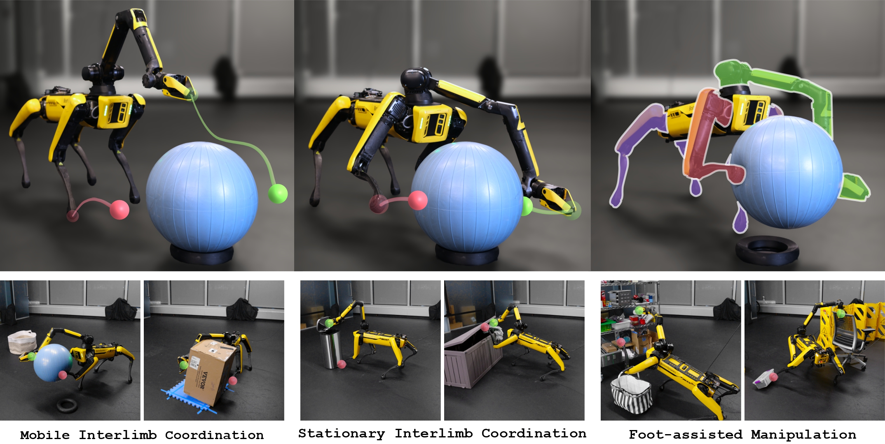

# ReLIC: Reinforcement Learning for Interlimb Coordination

[](https://docs.omniverse.nvidia.com/isaacsim/latest/overview.html)
[](https://isaac-sim.github.io/IsaacLab)
[](https://docs.python.org/3/whatsnew/3.10.html)
[](https://releases.ubuntu.com/20.04/)
[](https://pre-commit.com/)
[](https://opensource.org/license/mit)


This repository contains the official implementation for the paper "Versatile Loco-Manipulation through Flexible Interlimb Coordination", accepted to CoRL 2025.

[**Project Website**](https://relic-locoman.rai-inst.com/) | [**arXiv Paper**](https://arxiv.org/abs/2506.07876) | [**Blog Post**](https://rai-inst.com/resources/blog/reinforcement-learning-for-flexible-loco-manipulation/) | [**X**](https://x.com/rai_inst/status/1971590845817045218) | [**Threads**](https://www.threads.com/@robotics_and_ai_institute/post/DPEdj0UFEnm?xmt=AQF0fkVTtJFB-UTiEjOQATobby44KSl_DdfDymPMpr42Vg)

*Our ReLIC policy enables a quadruped robot to walk with three legs and manipulate with the arm and one leg.*

NEWS: Discover how ReLIC enables autonomous, dynamic whole-body manipulation through a sampling-based optimizer:
[**Blog Post**](https://rai-inst.com/resources/blog/combining-sampling-and-learning-for-dynamic-whole-body-manipulation/) | [**X**](https://x.com/rai_inst/status/1978113805604258161) | [**YouTube**](https://www.youtube.com/watch?v=nM_ZHzp8nQA)

> **Disclaimer:** This code is released as a research prototype and is not intended for production use. It may contain incomplete features or bugs. The RAI Institute does not provide maintenance or support for this software. Contributions via pull requests are welcome.

## Overview

**Reinforcement Learning for Interlimb Coordination (ReLIC)** is an approach that enables versatile loco-manipulation through flexible interlimb coordination. The core of our method is a single, adaptive controller that learns to seamlessly coordinate all of a robot's limbs. It intelligently bridges the execution of precise manipulation motions with the generation of stable, dynamic gaits, allowing the robot to interact with its environment in a versatile and robust manner.

<p align="center">
  
</p>

## Install
This project uses [Pixi](https://pixi.sh/latest/installation/) to manage dependencies and ensure a consistent development environment. You won't need to use `conda` or `virtualenv` separately or manually install `IsaacSim` or `IsaacLab`. Just follow the steps below to get started.

1. **Install Pixi**
    ```bash
    curl -fsSL https://pixi.sh/install.sh | sh
    ```

2. **Clone the repository**
    ```bash
    git clone https://github.com/bdaiinstitute/relic.git && cd relic
    ```

3. **Install dependencies**
    ```bash
    pixi install
    ```

4. **Activate the environment**
    ```bash
    pixi shell
    ```

Alternatively, you can install the project without Pixi by following the standard installation guides for [IsaacLab](https://isaac-sim.github.io/IsaacLab/v2.1.0/source/setup/installation/isaaclab_pip_installation.html) and its [extensions](https://github.com/isaac-sim/IsaacLabExtensionTemplate/tree/main?tab=readme-ov-file#installation).

## Train and Play

```bash
python scripts/rsl_rl/train.py --task Isaac-Spot-Interlimb-Phase-1-v0 --headless
python scripts/rsl_rl/play.py --task Isaac-Spot-Interlimb-Play-v0 --center
```

To achieve optimal deployment results, we implemented a weight curriculum with multiple training phases. Users can fine-tune the models from `Phase-2` to `Phase-4` to reproduce the results presented in our paper. The pre-trained weights can be found in `relic/source/relic/relic/assets/spot/pretrained`.

## Citation
```
@inproceedings{
    zhu2025versatile,
    title={Versatile Loco-Manipulation through Flexible Interlimb Coordination},
    author={Xinghao Zhu and Yuxin Chen and Lingfeng Sun and Farzad Niroui and Simon Le Cleac'h and Jiuguang Wang and Kuan Fang},
    booktitle={9th Annual Conference on Robot Learning},
    year={2025},
    url={https://openreview.net/forum?id=Spg25qkV81}
}
```

## Third-Party Code
We use RSL_RL for RL training and adapt the following scripts from [IsaacLabExtensionTemplate](https://github.com/isaac-sim/IsaacLabExtensionTemplate/tree/main?tab=readme-ov-file#installation).
- `scripts/rsl_rl`
- `source/relic/pyproject.toml`
- `source/relic/setup.py`
